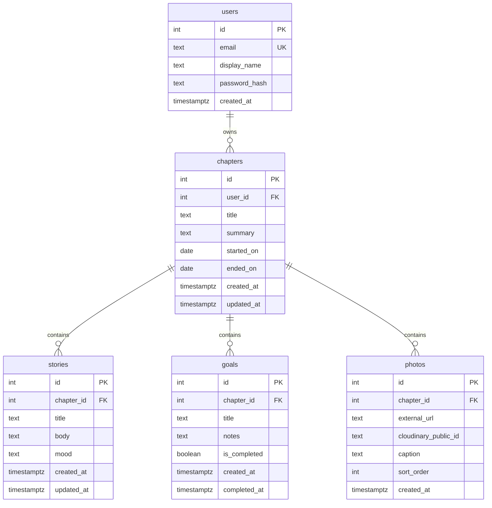

# Chapterly data model

Journal entries are stored in the **`stories`** table (one row per written memory inside a life chapter).

## Entity relationship diagram

## API mapping

| Concept        | Database table | API base path              |
|----------------|----------------|----------------------------|
| User account   | `users`        | `/api/auth`                |
| Life chapter   | `chapters`     | `/api/chapters`            |
| Journal entry  | `stories`      | `/api/journal-entries`     |
| Photo          | `photos`       | `/api/photos`              |
