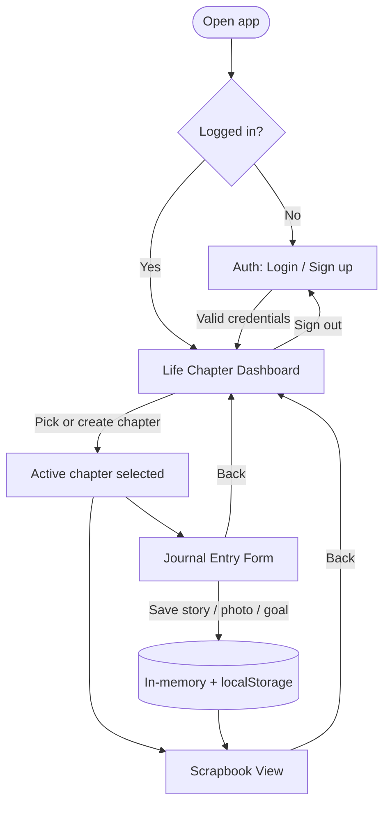
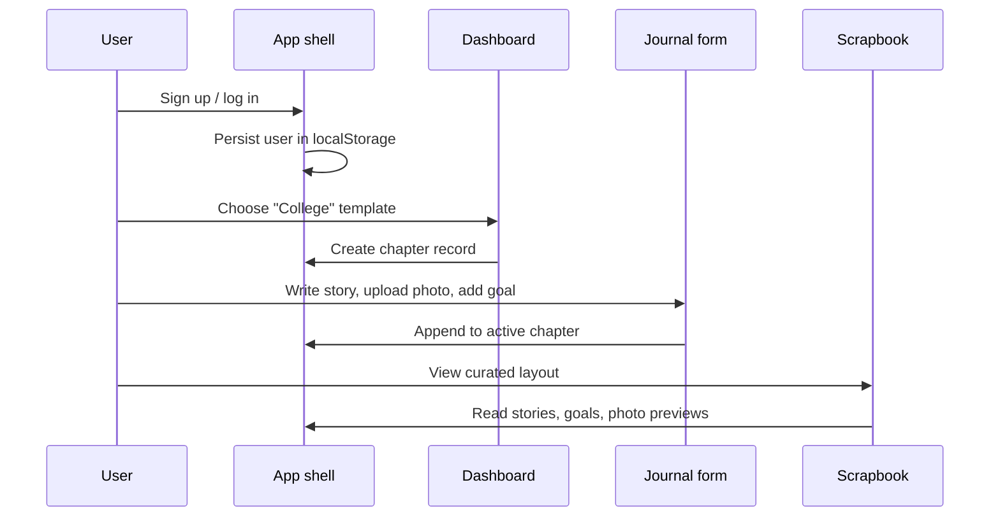

# Chapterly — UX wireframes & information flow

This document describes how users move through the web client. The live UI in `frontend/src` follows the same screens.

## Information flow (high level)



## Screen-by-screen data flow



## Wireframe: Auth (Login / Sign up)

```
┌─────────────────────────────────────────────┐
│              ✦ Chapterly                    │
│     Document your life, one chapter         │
│              at a time.                     │
├─────────────────────────────────────────────┤
│  [ Login ]  [ Sign up ]    ← toggle tabs    │
│                                             │
│  Display name (sign up only)                │
│  ┌─────────────────────────────────────┐   │
│  Email                                      │
│  ┌─────────────────────────────────────┐   │
│  Password                                     │
│  ┌─────────────────────────────────────┐   │
│                                             │
│  [ Continue ]                               │
└─────────────────────────────────────────────┘
```

## Wireframe: Life Chapter Dashboard

```
┌─────────────────────────────────────────────┐
│ Chapterly          Hi, Maya    [ Sign out ]   │
├─────────────────────────────────────────────┤
│  Your life chapters                         │
│  Pick a season to journal, or open one      │
│  you already started.                       │
│                                             │
│  ┌──────────┐ ┌──────────┐ ┌──────────┐    │
│  │ 🎓       │ │ 💕       │ │ ✈️       │    │
│  │ College  │ │ Dating   │ │ Gap Year │    │
│  │ [Start]  │ │ [Start]  │ │ [Start]  │    │
│  └──────────┘ └──────────┘ └──────────┘    │
│                                             │
│  In progress                                │
│  ┌─────────────────────────────────────┐   │
│  │ College · 3 stories · 2 goals       │   │
│  │ [ Journal ] [ Scrapbook ]           │   │
│  └─────────────────────────────────────┘   │
└─────────────────────────────────────────────┘
```

## Wireframe: Journal Entry Form

```
┌─────────────────────────────────────────────┐
│ ← Dashboard    Journal · College            │
├─────────────────────────────────────────────┤
│ Today's story                               │
│ Title ┌──────────────────────────────────┐  │
│ Body  ┌──────────────────────────────────┐  │
│       │ multiline                        │  │
│       └──────────────────────────────────┘  │
│ [ Save story ]                              │
├─────────────────────────────────────────────┤
│ Photos                                      │
│ [ Choose files ]  thumb thumb thumb           │
│ Caption ┌────────────────────────────────┐  │
│ [ Add photos ]                              │
├─────────────────────────────────────────────┤
│ Goals for this chapter                      │
│ Goal title ┌─────────────────────────────┐  │
│ Notes      ┌─────────────────────────────┐  │
│ [ Add goal ]                                │
│ ☑ Visit career fair                         │
└─────────────────────────────────────────────┘
```

## Wireframe: Scrapbook View

```
┌─────────────────────────────────────────────┐
│ ← Dashboard    Scrapbook · College   [Share]  │
├─────────────────────────────────────────────┤
│  ╔═══════════════════════════════════════╗  │
│  ║  COLLEGE CHAPTER                      ║  │
│  ║  "Freshman year highlights"           ║  │
│  ╠═══════════════════════════════════════╣  │
│  ║  [photo] [photo]   │ Story card       ║  │
│  ║                    │ Story card       ║  │
│  ║  Goals: ✓ ✓ ○      │ Story card       ║  │
│  ╚═══════════════════════════════════════╝  │
└─────────────────────────────────────────────┘
```

## View map (implementation)

| View key     | Component            | Purpose                          |
|-------------|----------------------|----------------------------------|
| `auth`      | `AuthForm`           | Login and sign-up                |
| `dashboard` | `ChapterDashboard`   | Pick templates & open chapters   |
| `journal`   | `JournalEntryForm`   | Stories, photos, goals           |
| `scrapbook` | `ScrapbookView`      | Read-only curated layout         |

Navigation is handled in `App.jsx` with a small `view` state machine (no router dependency yet).
